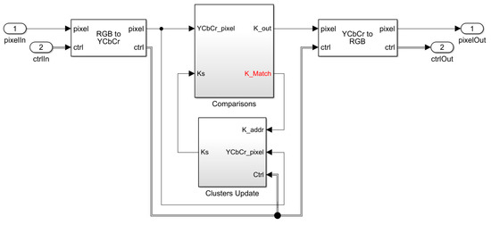

# FPGA_ImageSegmentation_Online_KMeans

* The Simulink model generates HDL files for K-means clustering IP core with AXI4 streaming interface.

* Please cite this work as follows

Aiman Badawi and Muhammad Bilal, "High-Level Synthesis of Online K-Means Clustering Hardware for a Real-Time Image Processing Pipeline", Journal of Imaging, 2019, 5, 38.
https://www.mdpi.com/2313-433X/5/3/38

